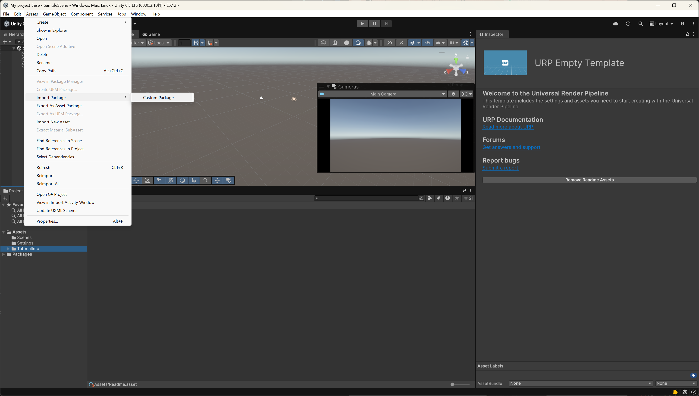
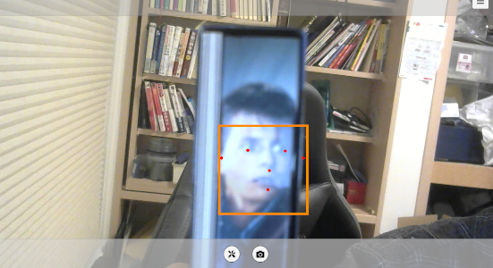

# Media Pipe Unity Plugin
## 1. バイナリDL

事前に以下バイナリを以下 Releases から取得すること  
https://github.com/homuler/MediaPipeUnityPlugin/releases  
- MediaPipeUnity.*.unitypackage
- MediaPipeUnityPlugin-all-stripped.zip


## 2. インポート手順
1. Unity エディタを起動  
2. `Assets > Import Package > Custom Package...` を開く



3. 以下をインポート  
   1. `MediaPipeUnity.*.unitypackage`（Core/Runtime系）  
4. 各パッケージで `Import` を実行（`All` チェック推奨）

## 3. 動作確認
/Assets/MediaPipeUnity/Samples/Scenes/Face Detection等から
シーンを読み込む

InvalidOperationException: You are trying to read Input using the UnityEngine.Input class, but you have switched active Input handling to Input System package in Player Settings.といったエラーが出る
対処は 変更ログ 5
Unity Editorを再起動し再度実行すると、動く



## 変更ログ (2026-03-01)

### 2) `Packages/manifest.json`

```diff
--- a/Packages/manifest.json
+++ b/Packages/manifest.json
@@
-    "com.unity.ugui": "2.0.0",
```

変更理由:
- MediaPipeUnityのManifestに書いてあるcom.unity.uguiのバージョンが古いのか
  エラーとなっていたため
## 変更ログ (2026-03-01) - Input例外対応

### 5) `ProjectSettings/ProjectSettings.asset`

```diff
--- a/ProjectSettings/ProjectSettings.asset
+++ b/ProjectSettings/ProjectSettings.asset
@@
-  activeInputHandler: 1
+  activeInputHandler: 2
```

変更理由:
- `StandaloneInputModule` は `UnityEngine.Input`（旧Input）を参照するため、`Input System package のみ` 設定だと `InvalidOperationException` が発生するため。
- まず `Both` にして旧/新Inputを共存させ、UIイベント系の実行時エラーを止めるため。
